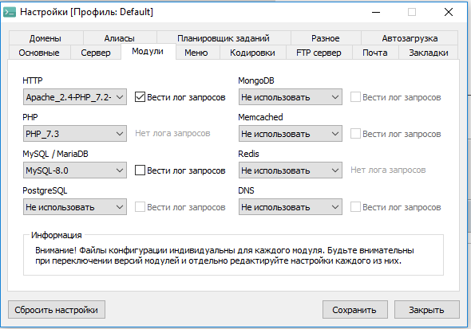
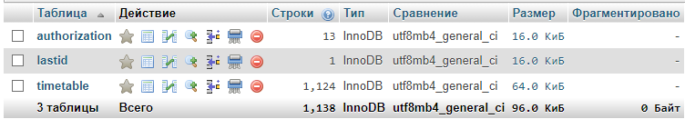
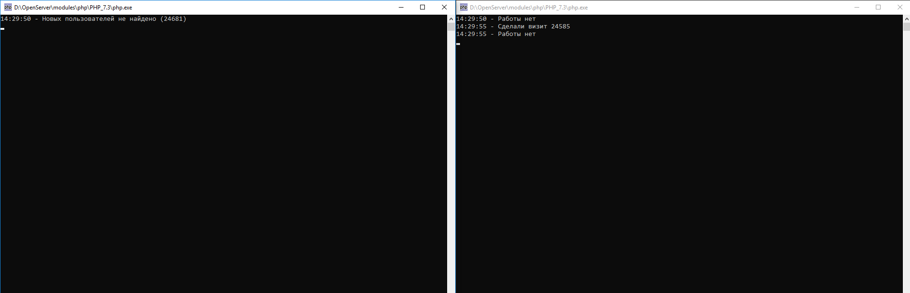

## aIDer
Проект по автоматизации пользователей Х на проекте goPromenad для удержания входящего трафика.
## Что нужно для работы?

- [ ] [OpenServer](https://ospanel.io/) для работы на локальном компьютере
- [ ] [PHP 7.3](https://www.php.net/releases/7_3_0.php) и выше
- [ ] [MySQL-8.0](https://dev.mysql.com/doc/relnotes/mysql/8.0/en/)

## Установка
[Для работы на локальном компьютере]
1. Устанавливаем OpenServer.
   1. Устанавливаем модули в соответствии скрином ниже 
   
   2. Качаем проект к себе на ПК.
   3. Папку размещаем по пути  `[Ваш путь установки]\OpenServer\domains\`. Должно быть что то вроде `[D:\Program Files\OpenServer\domains\aIDer\]`
   

2. Настраиваем базу данных.
    1. Создаем базу данных `prmdbot`
    2. Импортируем дампы таблицы `authorization`, `lastid`, `timetable` из папки `db` нашего проекта 
      

## Порядок использования
   1. В единственно поле таблицы `lasid` мы записываем значение id последнего зарегистрированного пользователя. Отправная точка для начала поиска новых юзеров.
   2. Запускаем bat файл в нашем проекте.
   3. Если все хорошо, то вы увидите 

   
## Контактная информация
    Telegram: @synim503
    Email:    
      